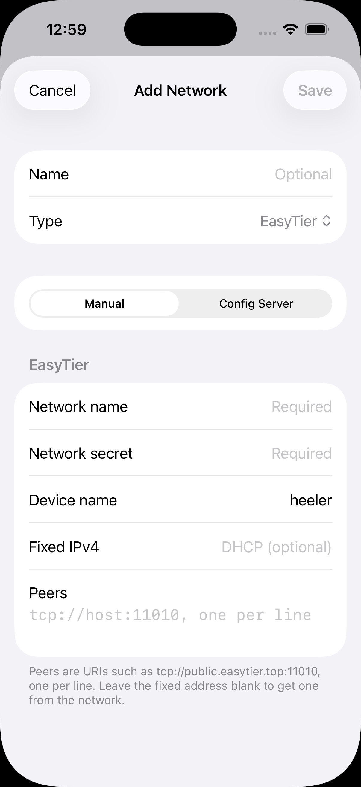
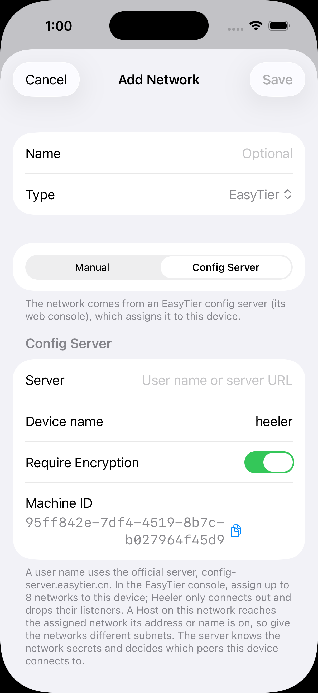

# EasyTier setup

Use EasyTier to reach a Mac running SSH and herdr from Heeler. Heeler contains its own EasyTier node: installing another VPN app or enabling an iOS system VPN is unnecessary. Start with **Manual** for one Mac; use **Config Server** when an administrator should assign networks to the phone from a web console.

This guide checks macOS commands against the official **EasyTier v2.6.4** release and Heeler's current form fields on **2026-10-09**. Check `easytier-core --version` and `--help` before applying the commands to another release. The Linux one-click installer, `systemctl`, and `/dev/net/tun` instructions do not apply to macOS.

## Before you start

- Complete [Prepare the Host](overlay-networks.md#prepare-the-host): enable SSH, prepare the login account and Heeler's authentication, and start herdr under that account.
- Use a Mac and phone that can reach the chosen EasyTier peer endpoint. The first example uses a trusted LAN; the Mac's LAN IPv4 is `192.168.1.20`. Replace that example with the Mac's actual address from System Settings > Network.
- Choose an unused virtual subnet, a network name, and a strong shared network secret. The examples use `10.144.144.0/24`, with `.2` for the Mac and `.3` for Heeler. These virtual addresses are separate from the LAN address.
- Keep the Mac awake and the foreground EasyTier process running during setup. Heeler's embedded node is active while the app is running; this does not turn other phone apps into EasyTier clients.

| Input | Example | Where it is used |
| --- | --- | --- |
| Network name | `heeler-home` | Identical on the Mac and in Heeler |
| Network secret | Your private shared secret | Identical on both nodes; different from the SSH password |
| Mac LAN address | `192.168.1.20` | Reachable address of the EasyTier listener |
| EasyTier listener | `tcp://192.168.1.20:21010` | Heeler's **Peers** field |
| Mac virtual address | `10.144.144.2/24` | Mac EasyTier node; Host address is `10.144.144.2` |
| Phone virtual address | `10.144.144.3/24` | Heeler's **Fixed IPv4** field |
| SSH endpoint | `10.144.144.2:22` | Heeler Host configuration |

The phone connects to TCP `21010` to enter EasyTier, then reaches SSH through the virtual network. Making the EasyTier endpoint reachable does **not** require forwarding public TCP `22` to the Mac.

## Install the macOS CLI

Download the matching ZIP from the [official v2.6.4 release](https://github.com/EasyTier/EasyTier/releases/tag/v2.6.4): `easytier-macos-aarch64-v2.6.4.zip` for Apple Silicon, or `easytier-macos-x86_64-v2.6.4.zip` for Intel. Extract it into a directory you control. The archive contains `easytier-core`, `easytier-cli`, and the web-console binaries; a system-wide installation is optional. This follows the official [manual CLI installation](https://github.com/EasyTier/easytier.github.io/blob/main/en/guide/installation.md).

In Terminal, set `ET_BIN` to the extracted directory. For example, after extracting the Apple Silicon archive in Downloads:

```sh
ET_BIN="$HOME/Downloads/easytier-macos-aarch64"
"$ET_BIN/easytier-core" --version
"$ET_BIN/easytier-core" --help
```

Expect version `2.6.4` for the commands below. If macOS blocks the download, verify its origin and use the macOS approval flow for that specific app. Do not disable system protection globally. A graphical alternative is the official macOS DMG on the same release page; its normal TUN/VPN setup has different permissions and routing behavior from this guide's CLI route.

## Manual: connect directly to the Mac

### 1. Check local SSH

On the Mac, confirm that its SSH server accepts a connection on IPv4 loopback:

```sh
nc -vz 127.0.0.1 22
```

This checks only the listening socket. Complete authentication and herdr checks through the [shared Host preparation](overlay-networks.md#prepare-the-host). If SSH uses another port, substitute it in both this check and the Heeler Host form.

### 2. Start a Mac peer without a TUN device

In the same Terminal, enter the network secret without placing it literally in shell history. The following prompt syntax is for macOS's default `zsh`; retain the same secret in your password manager for Heeler.

```zsh
read -rs 'ET_NETWORK_SECRET?EasyTier network secret: '
printf '\n'
export ET_NETWORK_SECRET
ET_LISTEN_HOST=192.168.1.20

"$ET_BIN/easytier-core" \
  --network-name heeler-home \
  --hostname heeler-mac \
  --ipv4 10.144.144.2/24 \
  --listeners "tcp://$ET_LISTEN_HOST:21010" \
  --rpc-portal 127.0.0.1:15888 \
  --no-tun \
  --private-mode true \
  --disable-upnp \
  --disable-p2p \
  --accept-dns false
```

Replace `ET_LISTEN_HOST` before starting. `ET_NETWORK_SECRET` is a supported v2.6.4 environment variable. Keep logs and configuration dumps private because they may contain connection settings or secrets. If the macOS firewall asks about incoming connections, allow this EasyTier peer for the intended network; keep the management RPC on loopback.

This command runs without `sudo`, creates no Mac TUN interface, and leaves system DNS unchanged. It uses the explicit TCP connection instead of automatic P2P discovery or router port mapping. EasyTier's [no-TUN mode](https://github.com/EasyTier/easytier.github.io/blob/main/en/guide/network/no-root.md) lets peers access the node's virtual address without installing OS routes. Ordinary Mac applications do not gain direct access to remote virtual addresses through this mode.

For this SSH setup, no extra `--port-forward` rule is needed: the [v2.6.4 TCP proxy](https://github.com/EasyTier/EasyTier/blob/v2.6.4/easytier/src/gateway/tcp_proxy.rs#L765) translates a TCP destination at the node's own virtual address to `127.0.0.1` with the same destination port. Thus `10.144.144.2:22` reaches `127.0.0.1:22`. This depends on SSH being available on IPv4 loopback and permitted by its access rules; it does not establish that every service or protocol is reachable. Other local services may also be reachable to trusted network members under EasyTier's proxy policy, so treat network membership as access to the Mac, not as an SSH-only port forward.

For a simulator on this same Mac, you can instead bind the listener to `127.0.0.1` and put `tcp://127.0.0.1:21010` in the simulator's Peers field. A physical iPhone's `127.0.0.1` is the phone itself and cannot address the Mac.

### 3. Add the network in Heeler

Open **Settings > Overlay Networks > Add Network**, select **EasyTier**, and fill in:

| Field | Value |
| --- | --- |
| Name | `Home EasyTier` (Heeler's display label) |
| Source | **Manual** |
| Network name | `heeler-home` |
| Network secret | The same secret entered on the Mac |
| Device name | `heeler-phone` |
| Fixed IPv4 | `10.144.144.3/24` |
| Peers | `tcp://192.168.1.20:21010`, using the Mac's actual reachable address |



The unconfigured form above shows where to enter the values in the table. [Screenshot provenance](overlay-networks.md#screenshots-and-maintenance).

Save, open the network, and select **Connect**. Look for the Mac peer with virtual address `10.144.144.2`. A blank Fixed IPv4 requests DHCP; this example uses distinct fixed addresses to make verification predictable. Include the network prefix and avoid `/32`, which EasyTier treats as part of a `/24`. Heeler's Manual **Peers** field accepts `tcp://` and `udp://` endpoints; a peer's virtual address is not the bootstrap endpoint unless some existing route already makes it reachable. The Config Server field below has a separate set of accepted schemes.

### 4. Add and verify the SSH Host

Use **Add Host** on the Mac's peer row, or follow [Connect from Heeler](overlay-networks.md#connect-from-heeler) and choose **Home EasyTier** as the Host's Network. Use `10.144.144.2` as the Host address, SSH port `22`, and the prepared Mac login account. Keep Jump Host empty for this direct setup.

Saving from the peer row opens the Host's connection checks. Verify the SSH fingerprint through a trusted channel before choosing **Trust**; successful overlay connectivity does not replace SSH authentication. Follow [Verify the connection](overlay-networks.md#verify-the-connection) through all preflight checks, live inventory, and input/output in a disposable terminal.

From a second Mac Terminal, set `ET_BIN` again to the extraction directory, then inspect the peer independently:

```sh
"$ET_BIN/easytier-cli" -p 127.0.0.1:15888 node
"$ET_BIN/easytier-cli" -p 127.0.0.1:15888 peer
"$ET_BIN/easytier-cli" -p 127.0.0.1:15888 route
```

Expect the Mac's `.2` address and the phone peer at `.3`. A peer entry alone does not prove SSH or herdr works. Conversely, testing the virtual address with an ordinary Mac `ssh` or `ping` command is not a substitute for Heeler's connection test when the Mac is running without a TUN interface.

### Reaching a Mac outside the LAN

The LAN address only works where the phone can reach that LAN. For another location, either provide an explicitly reachable EasyTier TCP endpoint or configure a shared EasyTier relay/bootstrap node that both devices can reach. For the latter, add `--peers tcp://YOUR_RELAY:PORT` to the Mac command and use that endpoint in Heeler's Peers field, preserving the matching network name and secret. Choose a relay you operate or are authorized to use; consult the official [shared-node networking guide](https://github.com/EasyTier/easytier.github.io/blob/main/en/guide/network/quick-networking.md) for relay connectivity and firewall requirements. The example's `--disable-p2p` keeps traffic on its explicit connections; automatic direct-path discovery is a separate configuration choice. A Config Server distributes settings but does not itself replace a reachable data-plane peer or relay.

## Config Server: assign the phone a network from a web console

This mode replaces Heeler's manual network parameters with configurations supplied by a trusted administrator. The Mac can keep running the Manual peer above. The console must assign an instance with that Mac's network name, secret, and reachable peer endpoint to Heeler's specific Machine ID.

### 1. Choose or start a configuration server

Obtain both the **web-console URL** and the **configuration-delivery URL**, including the account name/token, from its administrator. The web page or REST API URL is not the URL Heeler connects to. Supported delivery forms include `tcp://host:port/USER`, `udp://host:port/USER`, and `wss://host/path/USER`.

Heeler currently expands a bare user name to `udp://config-server.easytier.cn:22020/USER`. That is an address normalization rule, not a guarantee that hosted service is available. As checked on 2026-10-09, the [official console entry's source](https://github.com/EasyTier/easytier.github.io/blob/main/.vitepress/components/WebRedirect.vue) announces that the project no longer provides its own hosted web service and points to a third-party service. Use a full URL from your chosen operator; an account created at another service does not automatically belong to the old endpoint.

For a self-hosted trial on the same trusted LAN, use `easytier-web-embed` from the v2.6.4 macOS archive. In another Terminal, set `ET_BIN` to its extracted directory, then run:

```sh
ET_WEB_DATA="$HOME/Library/Application Support/Heeler-EasyTier-Console"
mkdir -p "$ET_WEB_DATA"
chmod 700 "$ET_WEB_DATA"
umask 077

"$ET_BIN/easytier-web-embed" \
  --db "$ET_WEB_DATA/et.db" \
  --config-server-port 22550 \
  --config-server-protocol tcp \
  --api-server-port 11750 \
  --api-server-addr 127.0.0.1 \
  --web-server-addr 127.0.0.1 \
  --api-host http://127.0.0.1:11750 \
  --console-log-level warn
```

Open `http://127.0.0.1:11750` on that Mac, register a local account, complete the displayed CAPTCHA yourself, and sign in. No external account is required. Use a distinct account name for this setup and keep its password private. The release also seeds default local accounts; review them and change their default passwords before making administration available to anyone else. See the official [web-console setup](https://github.com/EasyTier/easytier.github.io/blob/main/en/guide/network/web-console.md).

The command keeps the web UI and API on loopback, but **v2.6.4 binds the configuration-delivery port `22550` to all available IPv4/IPv6 interfaces** and has no `--config-server-addr` override. Restrict reachability to the intended clients with your network/firewall setup; do not describe this as a wholly loopback-only service. This behavior is explicit in the [server listener implementation](https://github.com/EasyTier/EasyTier/blob/v2.6.4/easytier-web/src/main.rs#L206). A physical phone uses the Mac's reachable address for delivery, such as `tcp://192.168.1.20:22550/USER`; only a simulator on this Mac can use `tcp://127.0.0.1:22550/USER`.

### 2. Register Heeler's device

In **Settings > Overlay Networks > Add Network**, choose **EasyTier > Config Server**. Set a display Name, enter the full delivery URL in **Server**, give the phone a recognizable **Device name**, and leave **Require Encryption** enabled. Save, select Connect, and copy the displayed **Machine ID** for comparison with the console's device list.



Use your own Machine ID. The screenshot's footer reflects the current app's legacy hosted-server wording; use the full operator-provided URL described above. [Screenshot provenance](overlay-networks.md#screenshots-and-maintenance).

The first state can be **Waiting** or a later **Not ready** with instructions to assign a network. Find the device by its name and exact Machine ID in the web console. Merely appearing in the device list does not give it a virtual address or a route to the Mac.

Require Encryption demands EasyTier's encrypted configuration tunnel; v2.6.4 implements the compatible Noise handshake. It encrypts the session without authenticating a `tcp://` or `udp://` server. For an untrusted network path, use an administrator-provided `wss://` endpoint with a certificate trusted by the phone. `ws://` sends the account token in the initial HTTP path, and Heeler refuses untrusted/self-signed certificates for Config Server `wss://`. Keep the switch enabled and correct the server configuration instead of using plaintext to bypass a connection failure. The configuration server can see the network secrets it distributes. These details are documented in [Heeler's Config Server implementation contract](../../Packages/HeelerOverlay/README.md#config-servers).

### 3. Assign and run an instance

On that device's web-console page, create a network instance and set:

| Console setting | Value for the running Mac example |
| --- | --- |
| Network name | `heeler-home` |
| Network secret | The Mac's existing shared secret |
| DHCP | Off |
| Virtual IPv4 | `10.144.144.4` |
| Network prefix | `24` |
| Networking method | Manual |
| Peer URL | `tcp://192.168.1.20:21010`, using the Mac's reachable listener |
| Traffic encryption | Enabled |

Use `.4` so this assigned instance does not duplicate the `.3` address if your Manual profile is also connected. Save the configuration **and run/enable the instance**. Creating a saved, stopped configuration alone is insufficient; the [v2.6.4 console](https://github.com/EasyTier/EasyTier/blob/v2.6.4/easytier-web/frontend-lib/src/components/RemoteManagement.vue#L209) separates those actions. Do not configure inbound proxies, credential files, or disabled encryption for the phone. Heeler drops listeners supplied by the console and only connects outward.

Return to Heeler's network details. Expect an assigned, running network with its virtual address, the Mac peer, and **Connected** status. Then add the Mac Host or edit its Network to select this Config Server entry; the Host address stays `10.144.144.2`. Complete the same [SSH and terminal acceptance](overlay-networks.md#verify-the-connection). To prove this route is doing the work, select it on the Host and disconnect the separate Manual profile before the final connection test.

Heeler accepts up to eight assigned networks. Give them distinct network names and subnets: a Host selects an assigned network by its destination, and an ambiguous match fails instead of choosing arbitrarily. The assigned-network section reports instances that were refused. Resetting Machine ID creates a new device identity that needs assignment again; it is not a routine reconnect step.

## Troubleshooting

| Symptom | Check |
| --- | --- |
| No Mac peer appears | Network name and secret must match; the peer URI must address a reachable listener with the same protocol and port. Check the Mac process, its bind address, LAN isolation, and firewall. |
| Works in the simulator but not on a phone | Replace loopback endpoints with an address reachable from the phone. Check both the data-plane peer endpoint and, if used, the configuration-delivery endpoint. |
| Network is Connected, but SSH fails | Check `127.0.0.1:22` on the no-TUN Mac, the Host's virtual address/SSH port, login account, SSH key authorization, and fingerprint. Inspect the specific preflight check in Heeler. |
| Config Server stays Waiting or Not ready | Confirm the full delivery URL, account/token, Machine ID, encryption support, and that an instance was actually assigned and started. A working web page proves only the web/API service is reachable. |
| Assigned network is refused | Check the reported reason, duplicate network names, unsupported inbound settings, disabled encryption, and the eight-network limit. |
| Several assigned networks fit the Host | Use distinct subnets and peer names in the console. Changing only Heeler's display label does not disambiguate routes. |
| Port already in use | Stop your earlier EasyTier instance or give each process separate listener and RPC ports; update the phone's peer URI to match. |
| The Mac's ordinary tools cannot reach virtual peers | This guide uses no TUN, so it creates no system route for those tools. Validate through Heeler or choose a separate, intentionally configured TUN/SOCKS/port-forward setup. |
| Connection ends after backgrounding or peer loss | Restore the peer, return to Heeler, and use Host Reconnect or terminal Reattach as appropriate. An online overlay alone does not prove the SSH session or terminal attachment recovered. |

An already assigned network can remain usable during a configuration-server outage. Do not depend on this for a fresh app launch or an unassigned device: those require successful configuration delivery. Test both cases separately if they matter to your deployment.

## Stop or remove this setup

Choose **Disconnect** to end the current network connection and keep its saved configuration. A Host can request another connection and start the network again. When retiring it, move its Hosts to another working route or remove those Host entries before deleting the network entry.

For these foreground Mac commands, press **Control-C** in the peer terminal and, if used, the web-console terminal. Run `unset ET_NETWORK_SECRET` in the peer's shell afterward. No boot service was installed by this guide. Retain the console database if you intend to keep its accounts and device assignments; removing it loses that state. Remove only the specific firewall/router rules and temporary SSH authorization that you added for this setup.

For persistent Mac startup, follow EasyTier's [macOS service guide](https://github.com/EasyTier/easytier.github.io/blob/main/en/guide/network/install-as-a-macos-service.md), adapting the service to your verified configuration and permissions. Running the usual TUN mode or installing a system daemon is a separate administrative choice from the foreground no-TUN setup above.

## Verification scope and sources

Simulator testing on Heeler candidate `bb266061` covered EasyTier Manual with the official v2.6.4 macOS no-TUN peer, SSH/preflight, herdr inventory, terminal input/output, background recovery, and peer restart. Config Server testing used a local v2.6.4 server with Require Encryption enabled and covered device registration, assignment, SSH/terminal traffic, and continued use of an already assigned network while that server was stopped. The later `eb52bf0c` candidate additionally verified automatic peer-to-Host onboarding and SSH on iPhone and iPad simulators. These are separate evidence sets; the earlier complete network scenarios were not all rerun on the later candidate.

This does not establish physical-device behavior, every Internet/NAT/relay topology, the eight-network boundary, overlapping assigned networks, or every WSS certificate failure. The native self-hosted web command above was checked against v2.6.4 CLI help and source; the earlier live Config Server fixture used an isolated container, not this exact deployment command. Run the acceptance steps on the devices and network you intend to use.

Official sources checked on 2026-10-09:

- [EasyTier v2.6.4 release and macOS assets](https://github.com/EasyTier/EasyTier/releases/tag/v2.6.4).
- [CLI installation](https://github.com/EasyTier/easytier.github.io/blob/main/en/guide/installation.md), [no-TUN mode](https://github.com/EasyTier/easytier.github.io/blob/main/en/guide/network/no-root.md), and [shared-node networking](https://github.com/EasyTier/easytier.github.io/blob/main/en/guide/network/quick-networking.md).
- [Web-console deployment](https://github.com/EasyTier/easytier.github.io/blob/main/en/guide/network/web-console.md) and [current hosted-service notice](https://github.com/EasyTier/easytier.github.io/blob/main/.vitepress/components/WebRedirect.vue).
- [v2.6.4 TCP proxy](https://github.com/EasyTier/EasyTier/blob/v2.6.4/easytier/src/gateway/tcp_proxy.rs#L765), [configuration-server listener](https://github.com/EasyTier/EasyTier/blob/v2.6.4/easytier-web/src/main.rs#L206), and [Noise configuration transport](https://github.com/EasyTier/EasyTier/blob/v2.6.4/easytier/src/web_client/security.rs).

Heeler-specific fields, limits, and routing are defined by [the network form](../../Sources/Heeler/Settings/OverlayNetworksSettingsView.swift), [the configuration URL contract](../../Packages/HeelerOverlay/Sources/HeelerOverlay/OverlayNode.swift), and [the overlay package documentation](../../Packages/HeelerOverlay/README.md).
