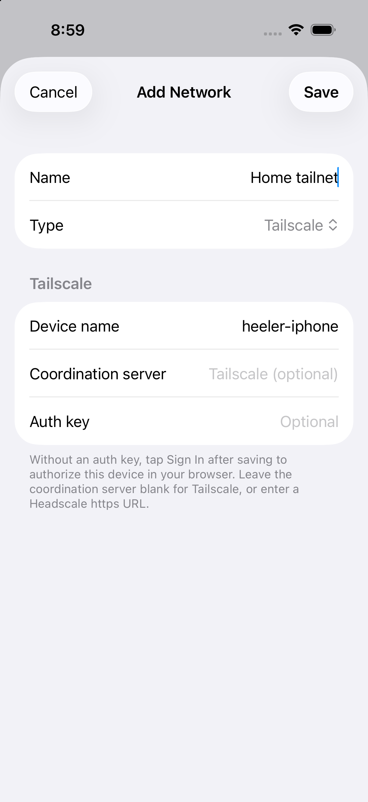

# Connect Heeler through an Overlay Network

Use Tailscale, ZeroTier, or EasyTier to reach a machine running herdr when a direct SSH connection is unavailable. This guide covers a macOS Host and Heeler on iPhone or iPad. It requires a Heeler build containing [PR #426](https://github.com/ZingerLittleBee/Heeler/pull/426), with **Settings > Overlay Networks** available; an older App Store build may not contain these settings.

Heeler runs its own network node inside the app. You do not need a separate Tailscale, ZeroTier, or EasyTier app on the phone, and Heeler does not create an iOS VPN configuration. The remote machine needs a matching network client, an SSH server, and a running herdr session. Network membership and SSH authentication are separate steps.

## Choose a setup

Read the common Host preparation below, follow one network tutorial, then return for connection verification. Each tutorial identifies where commands run and how to check the result.

| Tutorial | Host setup | How the phone joins | Effect on macOS networking |
| --- | --- | --- | --- |
| [Tailscale: standard macOS app](tailscale.md) | Install the standalone app and sign in | Sign in from Heeler to the same tailnet | Uses a network extension and VPN configuration |
| [Tailscale: userspace CLI](tailscale-userspace.md) | Run `tailscaled --tun=userspace-networking` and forward SSH with Serve | Same Heeler enrollment as the standard route | No TUN interface or system VPN configuration; no automatic routes for other Mac apps |
| [ZeroTier: private Central network](zerotier.md) | Install ZeroTier One, join, and authorize the Mac | Authorize Heeler's separate node ID | Creates a virtual network interface with managed addresses and routes |
| [EasyTier: Manual or Config Server](easytier.md) | Run the documented CLI configuration | Match network name/secret or assign a configuration to Heeler's Machine ID | The guide's `--no-tun` recipe creates no TUN; other EasyTier modes can use system networking |

For Linux or Windows Hosts, use the provider's platform-specific installation instructions, then the same Heeler enrollment and Host fields. Native Windows also needs the [Windows SSH and herdr setup](windows-setup.md). The Mac commands in these tutorials are not Windows instructions.

## Heeler setup screenshots

Open **Settings > Overlay Networks > Add Network**, then choose the provider and, for EasyTier, the Source. These are four alternative forms, not four steps to complete. Select an image to view its full-size screenshot, or follow its setup link for the field values and next action.

| Tailscale | ZeroTier |
| --- | --- |
| [](images/overlay-networks/tailscale-form.png) | [](images/overlay-networks/zerotier-form.png) |
| **Browser sign-in:** leave Coordination server and Auth key blank, then Save and Sign In. [Follow the Tailscale setup](tailscale.md#3-join-the-same-tailnet-from-heeler). | **Private network:** enter your network ID, then authorize your own **This device** node ID in Central. [Follow the ZeroTier setup](zerotier.md#3-heeler-and-central-join-and-authorize-the-app). |

| EasyTier Manual | EasyTier Config Server |
| --- | --- |
| [](images/overlay-networks/easytier-manual-form.png) | [](images/overlay-networks/easytier-config-server-form.png) |
| **Manual:** match the Mac's network name and secret; use a distinct virtual IP and a reachable peer endpoint. [Follow the Manual setup](easytier.md#3-add-the-network-in-heeler). | **Config Server:** use your operator's full Server URL, keep Require Encryption enabled, and assign a network to your Machine ID. [Follow the Config Server setup](easytier.md#2-register-heelers-device). |

The screenshots show unconfigured forms and disposable device IDs. Use your own IDs and values from the selected tutorial. [Capture details](#screenshots-and-maintenance). Continue with [Host preparation](#prepare-the-host) before connecting.

## Prepare the Host

Run these steps on the **Mac that will run herdr**, using the local account Heeler will log into.

1. Install and start [herdr](https://herdr.dev/docs/install/). Open or select the intended herdr session. The [README pairing instructions](../../README.md#adding-a-machine) describe the optional Heeler plugin and QR enrollment; manual Host entry works without a QR code.
2. Enable **System Settings > General > Sharing > Remote Login**. Under its access settings, allow the intended local account. Apple's [Remote Login guide](https://support.apple.com/guide/mac-help/allow-a-remote-computer-to-access-your-mac-mchlp1066/mac) documents the current controls. Keep the Mac awake during setup and remote use.
3. Record the account's short username, SSH port (normally `22`), and herdr session name (blank in Heeler selects the default). The username is a local SSH account, not a Tailscale or network-console login.
4. Read the SSH server fingerprint locally before trusting it from Heeler. For the standard macOS Ed25519 host key, run the command below. If the trust prompt shows another key algorithm, compare against that algorithm's host public key on the Mac.

```sh
id -un
herdr --version
ssh-keygen -lf /etc/ssh/ssh_host_ed25519_key.pub
```

Prepare one SSH authentication method:

| Heeler method | Preparation on the Host |
| --- | --- |
| Device Key | In the Host form, choose **Device Key > Copy authorized_keys Line**. Append that public line to the intended account's `~/.ssh/authorized_keys`, preserving existing keys. Keep `~/.ssh` private to that account (`700`) and `authorized_keys` private (`600`). The private key stays on the phone. |
| RSA Key | Choose **RSA Key > Copy RSA Public Key** and register that public key for the intended SSH account. |
| Password | Use the local account's password if the SSH server allows password authentication. Enter it in Heeler, not in a document or chat. |

An existing key enrolled through QR pairing can be reused. You can copy a public key from an unsaved Host form and cancel that form until the network is ready. For either userspace Host recipe, check that SSH listens on `127.0.0.1`, as shown in the corresponding tutorial. A full local SSH login additionally requires credentials available to the Mac; the phone's private key stays on the phone. Complete Heeler's own authentication check during onboarding.

## Connect from Heeler

First complete the chosen provider's tutorial until the Mac and Heeler have joined the same network and have usable addresses. A saved network alone is not enough: open it and use **Sign In** for Tailscale browser authorization, or **Connect** when using an auth key or another provider. Return to Heeler after browser authorization; it connects automatically.

1. Open **Hosts > Add Host**, or edit an existing Host. Tailscale and EasyTier also offer **Add Host…** on eligible peers in the network detail screen.
2. Scroll to **Network** and select the saved Overlay Network. **Direct** uses the phone's normal network connection, including any separately installed system VPN; it does not select Heeler's built-in overlay node.
3. Fill in the Host fields using the table below. Save the Host to begin onboarding.
4. Compare the displayed SSH fingerprint with the trusted value obtained on the Mac. Trust it only when it matches, then let the connection checks finish. If a check fails, follow its details and use **Run Checks Again** after correcting the cause.

| Host field | Value |
| --- | --- |
| Name | A recognizable label for this Mac |
| Address | The Mac's overlay address, without a port or CIDR suffix; use the provider tutorial to find it |
| Port | The destination SSH port, normally `22`; for Tailscale userspace, use the tailnet Serve listener's port |
| User | The Mac's short SSH username |
| Authentication | The prepared Device Key, RSA Key, or Password |
| herdr Session | The intended session name, or blank for default |
| Jump Host | Leave blank for these direct-to-Mac tutorials |
| Network | The saved Tailscale, ZeroTier, or EasyTier entry |

Tailscale offers **Choose from Tailnet…**; EasyTier offers **Choose from Network…**. Start with an IP address to make the destination unambiguous. ZeroTier requires a numeric managed IP copied from Central or the Host; its listed peer transport paths are not SSH addresses.

If you intentionally use an SSH Jump Host, the selected Overlay Network carries only the first hop to that Jump Host. The final Host's address is resolved and reached from the Jump Host. Follow the separate [Jump Host setup](vps-jump-host-setup.md) for the second hop, credentials, and host-key checks.

## Verify the connection

Record each result independently. Successful network enrollment does not prove that SSH or herdr works.

| Check | Passing result |
| --- | --- |
| Network membership | Both endpoints are enrolled in the intended network; required approvals are complete and usable addresses are assigned |
| Heeler network status | The selected network shows **Connected**; for EasyTier Config Server, the assigned network is running |
| SSH onboarding | Host-key verification matches the Mac and SSH authentication succeeds |
| herdr | Host checks pass and the expected session's Agent or Terminal inventory loads |
| Terminal traffic | In a disposable test terminal, a harmless command such as `pwd` returns output from the intended Mac |
| Remote access | Repeat from the phone's cellular connection or another outside network, with the Mac awake; a Simulator on the Mac does not establish this result |
| Resume | Background Heeler, return after its Background Grace Period, and verify that the Host reconnects and terminal traffic resumes |

Opening an Agent's live terminal can take over its existing attachment. Use a disposable terminal or an agreed test Agent for the last checks. Keep Heeler foregrounded during initial login and approval. Its nodes stop after the app's Background Grace Period and restart on demand; they do not provide an always-on phone VPN.

## Diagnose the failed layer

| Observation | Next step |
| --- | --- |
| No **Overlay Networks** settings | Confirm the installed Heeler build includes this feature |
| **Needs sign-in** | Tap the network's **Sign In** button, finish enrollment, return to Heeler, and check required device approval |
| **Waiting** | For ZeroTier, authorize the exact node ID; for EasyTier Config Server, assign and start a network for the exact Machine ID |
| Connected network, SSH timeout | Confirm the selected Network, destination IP/port, awake Host, SSH listener, and provider rules; see the provider-specific troubleshooting table |
| SSH authentication error | Check the local account, allowed Remote Login users, and authorized public key or password |
| SSH passes, herdr fails | Inspect the failing onboarding check for herdr executable/PATH, session, protocol version, or SSH stream-local forwarding |
| Returns immediately after **Disconnect** | A Host can request another connection. To retire the network, first move its Hosts to another working route or remove the affected Host entries, then delete the network |

## Agent handoff and evidence

An agent continuing setup needs: the chosen tutorial/mode, Host OS and client version, Heeler build, SSH username/port, intended network identifier, Host overlay IP, intended herdr session, and the last passing verification row. Keep passwords, auth keys, network secrets, private keys, state files, and token-bearing URLs in their designated local store or input field. Include sanitized errors in the handoff, not complete credential-bearing logs.

Inspect an existing installation before starting another daemon. Reuse the identified network, account, and CLI socket; do not silently create a replacement network when enrollment stalls. Browser login and OS permission prompts should be completed in their actual UI, with the account and requested access visible to the operator.

These tutorials were prepared on **2026-10-09** against the local PR #426 implementation at `eb52bf0c`. The earlier network scenarios below ran on `bb266061`; the later `eb52bf0c` additionally passed EasyTier peer-to-Host onboarding and SSH/inventory checks on iPhone and iPad Simulators. These are separate evidence sets, not a claim that every scenario was rerun on the later build. Repeat the checklist above on the actual deployment.

| Route | Existing live evidence | Still requires deployment-specific verification |
| --- | --- | --- |
| Tailscale | Mac userspace daemon, real tailnet, Heeler Simulator SSH/herdr/terminal, background recovery | Standard macOS app installation and physical-phone/cellular path |
| ZeroTier | Controller-less IPv6 ad-hoc network, Simulator SSH/herdr/terminal and recovery | Central enrollment, custom Planet/Moon, private-controller bootstrap, overlapping IPv4 |
| EasyTier | Manual and encrypted Config Server assignment, Simulator SSH/herdr/terminal, peer restart | Physical-phone path, eight-network boundary, overlapping assignments, WSS failure cases |

## Screenshots and maintenance

The provider tutorials include unedited screenshots of the actual Heeler forms, captured on an iPhone 17 Pro Simulator running iOS 26.5, in light appearance at default text size. The Tailscale form was refreshed on **2026-10-09** for the single-button Sign In flow; the other forms come from build `eb52bf0c`. Names are examples, and credentials are left blank. The pictured ZeroTier node ID and EasyTier Machine ID belong to the isolated tutorial device; use your own IDs. No production account, auth key, or network secret appears in the images.

Text tables describe every required field so the procedures remain usable without images. When labels or behavior change, update the relevant tutorial and its screenshot together. Consult [the overlay architecture](../adr/0021-in-process-overlay-networks.md) and [the source map](../agents/navigation.md) for implementation work. Official sources are linked beside each provider's instructions.
