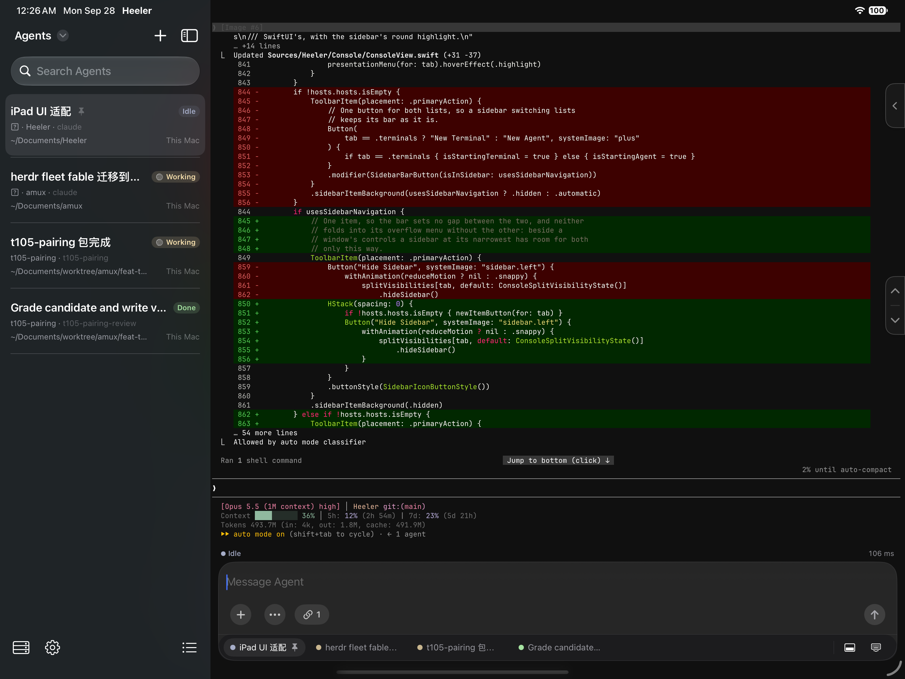
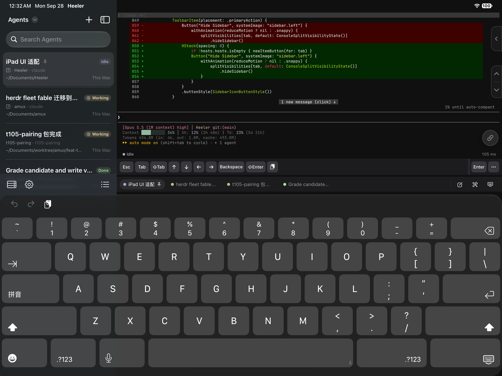
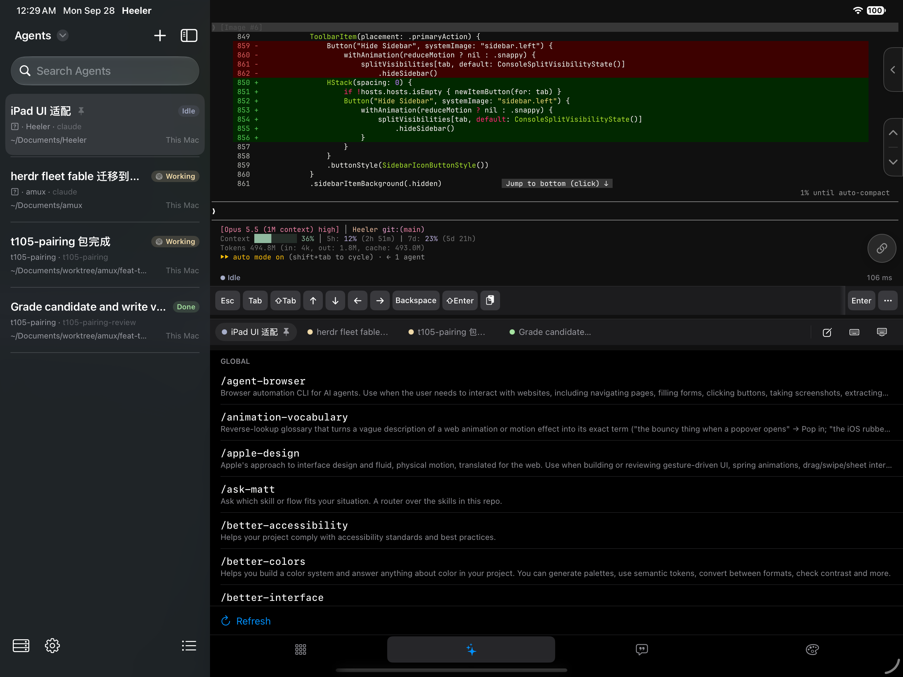
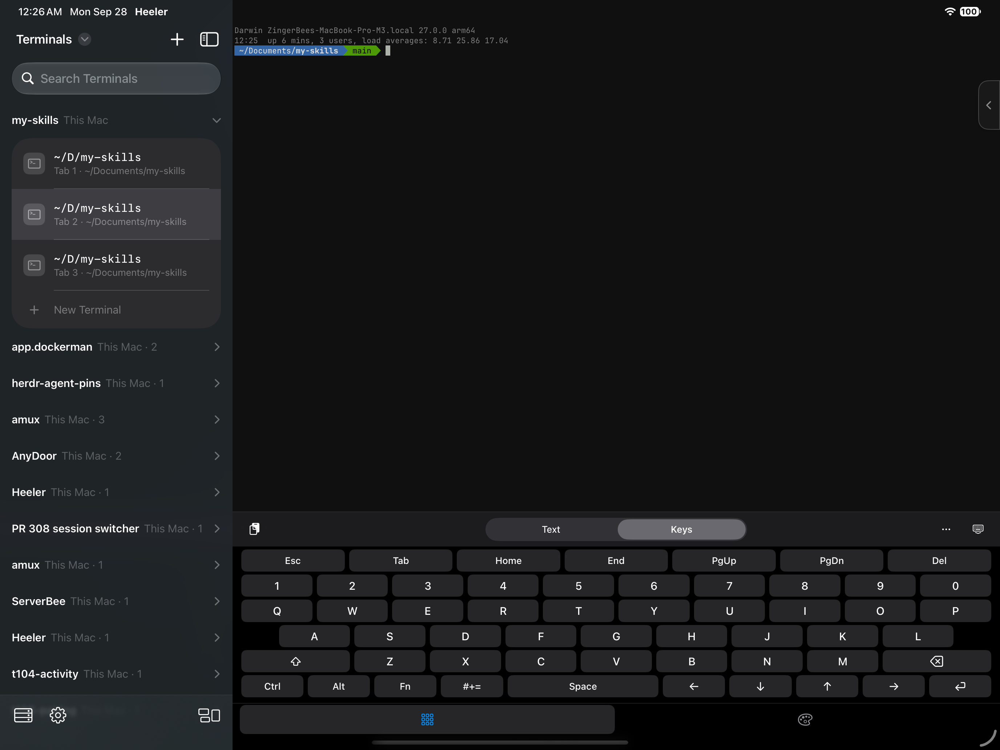
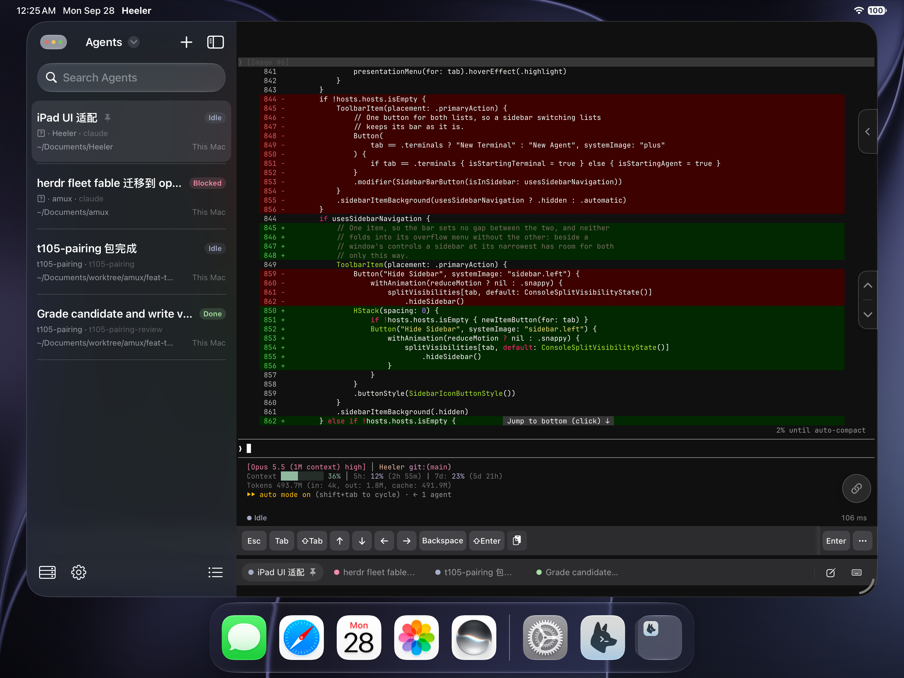

# Heeler on iPad

Agent Console, Direct Input, Skills, Terminals, and windowed presentation on iPad.

[Back to README](../README.md)

## Agent Console

Keep the Agent list visible alongside the selected conversation.

## Terminal keyboard

Type straight into the Agent's terminal with Direct Input and the iOS keyboard.

## Skills

Browse Agent Skills from the tools keyboard.

## Terminals

Open a plain shell in any Workspace, with Text and Keys modes.

## Windowed presentation

Keep the console open in a floating iPad window.

